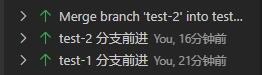

# 分支

分支的目的是让你当前的工作和主线上分开，直到你主动合并分支之前，你的工作和开发将不会影响到主线。Git 利用快照和提交对象，分支就是一个可移动的指针，指向了某一个提交对象。

## 新建分支

```shell
# 采用缩写
# git branch draft
# git checkout draft
git checkout -b draft
```

---

新建分支（branch）参考 Pro Git 的[这一章节](https://git-scm.com/book/zh/v2/Git-%E5%88%86%E6%94%AF-%E5%88%86%E6%94%AF%E7%9A%84%E6%96%B0%E5%BB%BA%E4%B8%8E%E5%90%88%E5%B9%B6)绝大多少情况下，我们都是从“当前”分支新建，只需要执行下面的命令就可以。

```
git checkout -b 新分支名
```

将会自动新建和移动到对应的分支上。这一操作可以在 [Learn Git Branching](https://learngitbranching.js.org/?locale=zh_CN) 小游戏基础篇的第二个关卡学习和实验。

注：checkout 经常被翻译成检出，可以理解为是查看或者切换到某个分支的意思。

## 合并分支

快进：

只在一个分支上提交内容，每次在开发完功能后将分支上的操作合并到主分支上的情况，这种操作不会产生分支的合并记录，实际上只是移动了分支的指针，整体的提交日志依然是线性的，不会有分叉。

```shell
# 将较新的分支内容合并到较旧的分支上
git checkout main
git merge draft

# 删除分支（对于不需要的分支，可以根据实际情况来进行删除）
git branch -d draft
```

如果是单纯的把后续的提交添加到之前的分支上，也就是在一条线性的没有分叉的提交线上移动分支，这时候只要检出到想要移动的分支上，然后使用 `git merge` 命令将当前分支的指针移动过去就可以，这种分支合并只会改变这个分支的提交列表，并不会有合并提交产生。

---

没有冲突的三方合并：

这种一般是单人开发中经常遇到的情况，基于某一个结点（提交快照）建立了两个分支，在两个分支都开发和操作结束后，要将两个分支的内容都合并到主分支上的操作。这种情况下，合并的三方分别是两个分叉的终点和两个分叉的最近的共同祖先结点。

同时要注意的是，如果从原有的分支上分离出来了新的分支，并且原先的分支依旧在前进，这种情况也是属于三方合并的。此时的分支状态就相当于已经进行了一次快进，将主分支的指针向前移动到了某个分支的终点。但是不鼓励这种做法，如果原本分支的修改很容易产生可以影响到其他分支的冲突。

```shell
# 先移动到主分支上
git checkout test

# 快速前进到第一个分支上
git merge test-1

# 和第二个分支触发三方合并
git merge test-2

# 合并结束后删除已经合并的分支
git branch -d test-1
git branch -d test-2
```

分支合并后的结果如下图：



可以看出来，这样操作产生了分支合并的 Git 记录。等于说在 Git 的操作下，产生了一个新的快照，test-1 和 test-2 的最后一次提交是这个快照的两个父级，而 test 这个分支指针指向了这个自动产生的提交上。

以上操作可以查看本项目 test/1 文件夹中的内容。

---

而对于有冲突的分支合并，分别在 test/2 和 test/3 这两个文件夹中进行了测试。主要是针对两个分支只有一次提交产生的冲突和有多次提交产生的冲突在最后合并分支后的显示。这里执行的命令和上面相同，虽然 Git 可以使用命令的方式去处理冲突的文件，但是还是直接使用 ide 提供的文件编辑来的更方便也更符合大多数使用场景。

在有冲突的分支合并中，有以下内容需要多加注意：

可以看到，git 在遇到冲突的时候，会把不能进行合并的两个提交块进行对比显示，针对修改的代码内容，将会将两块内容都进行对比，即便是两个不同的提交并没有修改同一行代码，或者修改的内容前后添加了空行去分割。而对于新增的内容，如果新增的内容是相同的，就不会显示为冲突。

同时我们观察合并分支这个行为，在 git log 中的显示可以看出，他本质上也是一次 commit 只不过带上了一个 Merge 属性，写着合并的是那两个提交的哈希。正因为合并分支也是新增一个提交，所以在一些查看 Git 记录的插件中也能看到这次提交的内容。在这个提交中，只会显示当前被合并进来的分支中的独有的内容。如果是两个分支将同一个文件修改为同样的状态，或者添加了同样的文件，那么这些已经被提交的文件并不会显示在这次的合并提交中。

有冲突的文件将会标记好对应提交的哈希放在文件中，需要自己去进行处理后暂存。而已经暂存好的文件并不需要去改动，因为这是 Git 自己处理发现的被合并进主分支的分支所修改的内容，你修改好的发生冲突的文件将会覆盖原先提交中的那个文件。你点开查看提交内容的时候，显示的内容是不同（文件的变更前后的提交哈希不同），而另一个没有冲突的文件点卡后显示的内容是相同的（文件被加入的哈希是相同的）。

## 分支前后关系如何显示

在 vsc 上显示的提交顺序是优先按照祖先关系排序，然后根据提交的时间。

如：按照时间顺序，先是对 test-1 分支进行了提交，然后和 test-2 分支交替提交一些内容，在快结束的时候，突然意识到应该提供一个双方修改相同的文件，或者是在提交 1 处存在 bug 需要修复，于是在 test 分支上新增了文件后，利用 Git rebase 来将这次的提交作为两个分支的共同祖先结点，这样两个分支就仿佛从一开始就有了这个同样的文件。然后先快进到 test-1 分支，在合并 test-2 分支。但是最后显示的效果将会是这样：

```
     2-3---5--
    /         \
-1-7           merge
    \         /
     ----4---6
```

其中，test 分支一开始指向的是提交节点 1，test-1 分支的内容是 2、3、5 提交节点，4、6 为 test-2 提交结点，而提交 7 就是利用 rebase 来添加到主分支上的提交内容。

这样我们也得到了一个使用 rebase 的方式来修改根节点 bug 的技巧。

具体操作：

```shell

# 先移动到主分支上
git checkout test

# 进行修改和提交你要改动的内容，生成提交 7

# 移动到 test-1 分支上，进行变基操作
git checkout test-1
git rebase test

# test-2 进行同样的操作
git checkout test-2
git rebase test

```

---

以上修改的具体 Git 命令和操作截图以及文件，可以查看 [test/1](https://github.com/Storh/git-example/tree/main/test/1)、[test/2](https://github.com/Storh/git-example/tree/main/test/2) 和 [test/3](https://github.com/Storh/git-example/tree/main/test/3) 这三个文件夹中的内容和信息。
