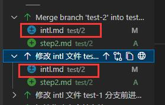

``` shell
git checkout test
# 此时合并并不会有冲突
git merge test-1

# 现在合并的时候有了冲突
git merge test-2

# 合并完成后删除分支
git branch -d test-1
git branch -d test-2
```

在合并冲突的时候并没有对冲突进行修改，而是留下了冲突来做一个示范。

可以看到，git在遇到冲突的时候，会把不能进行合并的两个提交块进行对比显示，针对修改的代码内容，将会将两块内容都进行对比，即便是两个不同的提交并没有冲突到的。在这里的例子就是，有冲突的是第一行，但是第二行和第三行也被牵扯了进来。而对于新增的内容，如果新增的内容是相同的，就不会显示为冲突。

同时我们观察合并分支这个行为，在 git log 中的显示可以看出，他本质上也是一次 commit 只不过带上了一个 Merge 属性，写着合并的是那两个提交的哈希。正因为合并分支也是新增一个提交，所以在一些查看 Git 记录的插件中也能看到这次提交的内容。一般是被合并到主分支的提交内容被重新提交，如果没有冲突，将像 test/1 中的那个项目一样，单纯的就是重复合并到主分支的提交内容；如果有冲突，对于没有冲突的将会维持先前的提交不变，而你修改好的发生冲突的文件将会覆盖原先提交中的那个文件。如下图所示，你点开查看提交内容的时候，显示的内容是不同（文件的变更前后的提交哈希不同），而另一个没有冲突的文件点卡后显示的内容是相同的（文件被加入的哈希是相同的）。


