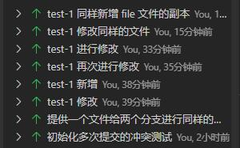
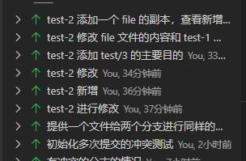
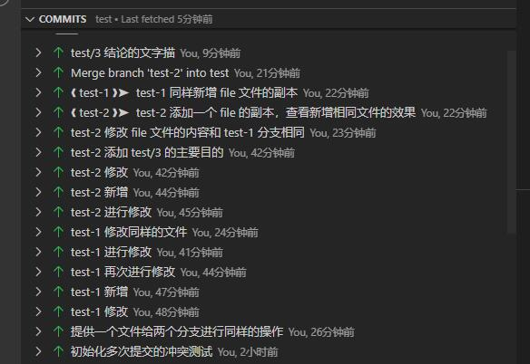

# 测试目的

这个文件夹中主要对之前 test/2 中进行的操作进行了一次重复，将先前的每个分支的单纯提交变成了两个分支的轮流提交，来查看后续合并分支时的冲突处理和 vsc 上显示的 Git commit 信息的先后关系。

同时也可以验证，merge 的时候提交的内容是被合并进来分支的最后一次提交，还是被合并的所有提交的集合。

# 测试结论

在 vsc 上显示的提交顺序是优先按照祖先关系排序，然后根据提交的时间，如果按照时间顺序，先是对 test-1 分支进行了提交，然后和 test-2 分支交替提交一些内容，在快结束的时候，突然意识到应该提供一个双方修改相同的文件，于是在 test 分支上新增了文件后，利用 Git rebase 来将这次的提交作为两个分支的共同祖先结点，这样两个分支就仿佛从一开始就有了这个同样的文件。然后先快进到 test-1 分支，在合并 test-2 分支。

下面分别是 test-1 分支的提交记录顺序、test-2 分支的提交记录顺序和 test 在合并分支后显示的提交记录：







显然，提供一个文件给两个分支进行同样的操作这个提交，在 test-1 和 test-2 分支的很多修改提交之后，但是合并后的结果却是在 test-1 和 test-2 的分支提交之前显示（能把 test 分支分叉后续提交的内容修改为分叉点，及分叉点后移，是使用了 ```git rebase``` 这个命令），大致的提交图示如下：

```
     2-3---5--
    /         \
-1-7           merge
    \         /
     ----4---6
```

---

分支合并显示的修改的文件是三方合并时不同的文件，在两个分支中修改的 file 文件和新增 file copy 文件完全相同，在 test-1 合并到 test 分支后，在将 test-2 合并到 test 分支的时候，这两个文件完全相同，所以不会在合并分支的内容中显示，如下图所示：


因为 test-1 和 test-2 的 file 文件和 file copy 是完全相同的，所以这次的 merge 提交中只含有了 test-2 分支的独有内容。其中，intl 文件是产生冲突的文件。

此时就可以总结，会发生冲突的文件是三方合并时 Git 不能自己处理的部分，特别要注意的一点是，即便你的代码块和先前的代码直接有空行隔开，但是在同样的位置（指原始情况的上下文之间）添加不同的代码，依旧会触发冲突。而合并分支的这次提交，是被合并到主分支上的分支（在这个 test 里是 test-2 分支）中，和另外两方不同的内容（test-2 分支中新增的文件和 test-2 分支修改了而 test-1 分支没有修改的代码）。
